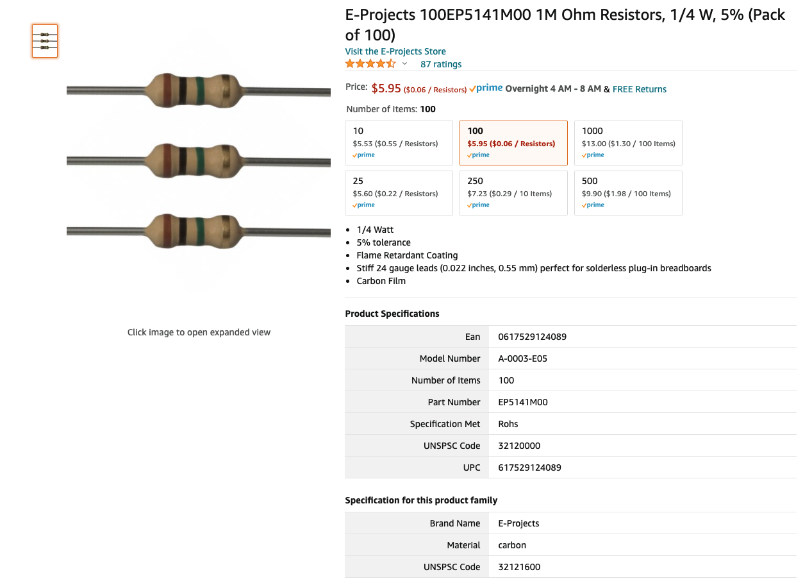
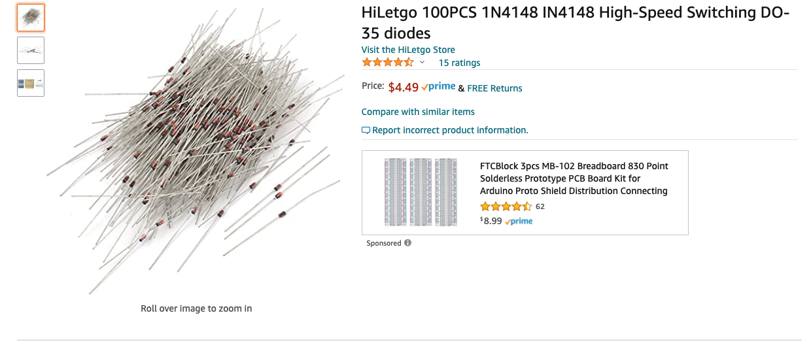

# DiyCtSensor-Block-Occpancy-Detection-Lib

----


# <a href="https://github.com/adarshkumarsingh83/DiyCtSensor-Block-Occpancy-Detection-Lib/archive/production.zip"> Library download link </a>

## About the lib 
```
DiyCtSensor-Block-Detection-Lib is for supporing multiple Ct Sensor Based Block together 
 with less complexcity of the programming 
 this library can work with the Diy type of CT based block dection 
 but it has analog signal so its limited to the analog pins of the  arduino 
 we can set the blocks sensors and their analog pin on arduino 
 and get the status of the sensors by calling methods for block occupancy decection 
```

## item used for circuit 







## Steps for using lib

### YOUTUBE LINK LIBRARY DETAILS AND DEMO EXAMPLES
[](https://www.youtube.com/watch?v=vTDKo_aSGnA "DIY CT SENSOR FOR BLOCK DETECTION")

[](https://www.youtube.com/watch?v=FrCftH3ercs "DIY CT SENSOR FOR BLOCK DETECTION")

### include the header file

```
#include "DiySensor.h"
```

### define the number of the Ctsensor  we are about to use 
```
#define CT_SENSOR_COUNT 2
```

### define the object for the CtSensor
```
DiySensor diySensor;
```


### initialize the CtSensor object for using its 
* diySensor.initBlockSensors(CT_SENSOR_COUNT);
```
void setup() {
	............
    diySensor.initBlockSensors(CT_SENSOR_COUNT);
  .............

}
```

### for debug messages a initialize Serial in setup
```

void setup() {
  
  Serial.begin(xxxx); // xxx can be any valid supported number 

  .........
}
```

### Configure the Sensors with sequence and its respective arduino analog pin 
* diySensor.setBlockSensorPins(CT_SENSOR_SEQUENCE_NUMBER, CT_SENSOR_ARDUINO_PIN_NUMBER);
```
void setup() {
  .................
  diySensor.setBlockSensorPins(1, A0);
  diySensor.setBlockSensorPins(2, A1);
  .................
}
```

### Configure the Block sensor Name 
* diySensor.setBlockSensorName(CT_SENSOR_SEQUENCE_NUMBER, "BLOCK_SENSOR_NAME");
```
void setup() {
  .................
  diySensor.setBlockSensorName(1, "BLOCK_SENSOR_NAME");
  .................
}
```


### Configure the Sensors with Occupancy Threshhold 
* diySensor.setDiyOccupancyThreshhold(CT_SENSOR_SEQUENCE_NUMBER, CT_SENSOR_OCCUPANCY_THRESHHOLD);
```
void setup() {
  .................
  diySensor.setDiyOccupancyThreshhold(1, 600);
  .................
}
```

### Configure the Sensors with Occupancy Samples 
* diySensor.setDiyUnOccupancySamples(CT_SENSOR_SEQUENCE_NUMBER, CT_SENSOR_OCCUPANCY_SAMPLE);
```
void setup() {
  .................
  diySensor.setDiyUnOccupancySamples(1, 100);
  .................
}
```

### use lib method for getting the Ctsensor status 
* bool state = diySensor.isSensorBlockOccupied(CT_SENSOR_SEQUENCE_NUMBER);
	* it will return false when sequence number is invalid 
	* it will return true if sensor is active 
	* it will reurn false when sensor is inactive 
```
void loop() {
  delay(500);

     ...............

    bool state = diySensor.isSensorBlockOccupied(CT_SENSOR_SEQUENCE_NUMBER);
	...............
}
```


## Connection details 


```
## COMPONENT REQUETIED 
1. 5A AC Current Transformer 
2. 1N4148 Switching Diode 100V 200mA Hole DO-35
3. 1M Ohm Resistors, 1/4 W, 5%
4. jumper wire 
5. led for showing block occupied 

## connections details 
0. repeate below 1-3 step for block A and block B 
1. 5Amp CT +ve and -ve side to the breadboard and Ct has block A and Block B lines turns for dectections
2. 1M Ohm Resistors in series to the -ve side of the CT 
3. 1N4148 Switching Diode to the -ve side of the CT with blck directed toward the -ve side of the CT 
4. from arduino 5+ve and 5-ve to the breadboard 
5. from breadboard +5v to the +ve side of the CT 
6. from breadboad -5ve to the end of the serial resitors 
7. take one jumper from other end of the dioad to the A0 and A1 pins for botht the blocks 
8. pin 13 and pin 12 for the +ve resitor side of led of block and block b 
9. use the common gnd from borad board for the leds 

```


### Complete Example
```
#include "DiySensor.h"

#define CT_SENSOR_COUNT 2
#define X_BLOCK_LED 13
#define Y_BLOCK_LED 12

DiySensor diySensor;
void setup() {
  Serial.begin(9600);
  diySensor.initBlockSensors(CT_SENSOR_COUNT);
  diySensor.setBlockSensorPins(1, A0);
  diySensor.setBlockSensorName(1, "BLOCK-A");
  diySensor.setDiyOccupancyThreshhold(1, 800);
  diySensor.setDiyUnOccupancySamples(1, 20);


  diySensor.setBlockSensorPins(2, A1);
  diySensor.setBlockSensorName(2, "BLOCK-B");
  diySensor.setDiyOccupancyThreshhold(2, 800);
  diySensor.setDiyUnOccupancySamples(2, 20);


  pinMode(X_BLOCK_LED, OUTPUT);
  pinMode(Y_BLOCK_LED, OUTPUT);
}

void loop() {
  bool xBlockState = diySensor.isSensorBlockOccupied(1);
  if (xBlockState) {
    digitalWrite(X_BLOCK_LED, HIGH);
  } else {
    digitalWrite(X_BLOCK_LED, LOW);
  }

  bool yBlockState = diySensor.isSensorBlockOccupied(2);
  if (yBlockState) {
    digitalWrite(Y_BLOCK_LED, HIGH);
  } else {
    digitalWrite(Y_BLOCK_LED, LOW);
  }

}

````

